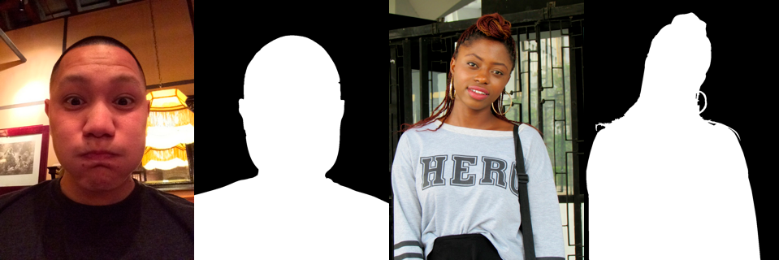

# Image Segmentation Model in Keras
---
Nov 30, 2018

``Goal:`` to build a semantic segmentation model to separate background from a human in an image for the [PicsArt-online hack](https://picsart.ai/en/picsartaidays).

``Result:`` landed in top-65 out of more than 110 teams. Recieved a final dice score of 0.966 on submission.

### Data

The host provided a dataset with real images and their binary masks encoded as rle ([download here](https://s3.eu-central-1.amazonaws.com/datasouls/public/picsart_hack_online_data.zip)).
There were 1491 training samples.

##### Submission
For submission 2177 real images were provided. 

##### Unpacking
Unzip the downloaded archive into _data_ directory for training

##### Samples

### Training

##### Model Architecture
A regular U-Net architecture was chosen for this task. It had 5 encoding blocks as convolutional layers with batchnorm and relu activation + max pooling + dropout. They were followed by 4 blocks of upsampling convlution and finished by 2 convolutions targeted to reduce the channels size.

##### Optimization
[Dice coefficient](https://en.wikipedia.org/wiki/S%C3%B8rensen%E2%80%93Dice_coefficient) was selected as a loss function and scoring metrics as per the host's problem description.
Adagrad was finally selected as it performed better than Adam and RMSProp.
Model was trained for about 100 epochs with batch size of 16 on a single Tesla P100 gpu.
Validation score exceeded 0.95 whereas submission score reached 0.966.

##### Thresholding
Ensembling a few bet performing results didn't yield results better than 1 best model.
Threshold was selected on a validation set to maximize accuracy.
